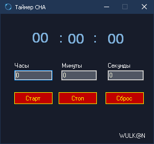
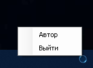

# Таймер сна (Ttimer) v1.0.0.0

[-lightgrey.svg)](https://github.com/wulkan-Git/SleepTimer)
[](LICENSE)
[](https://www.microsoft.com/windows)

**Простой таймер сна для выключения устройства в заданное время.** Разработан в 2015 году на C# (Windows Forms).



## 📝 Описание

Иногда нужно выключить компьютер или ноутбук в определённое время, но не хочется оставлять его включенным на всю ночь. Этот простой и легковесный таймер сделает это за вас!

**Функционал:**
*   Установка времени до выключения (часы, минуты, секунды).
*   Старт / Пауза (Стоп) отсчета.
*   Сброс таймера.
*   Автоматическое выключение компьютера по истечении времени.

## 📸 Скриншоты

| Главное окно | Окно информации |
|--------------|-----------------|
|  |  |

## 🚀 Запуск программы

1.  **Требования:**
    *   Операционная система: Windows 11, 10, 8.1, 8, 7 (x86 или x64).
    *   Установленный [.NET Framework 4.x](https://dotnet.microsoft.com/download/dotnet-framework) (Скорее всего уже есть в системе).
2.  **Скачать:**
    *   Перейдите в раздел [Releases](https://github.com/wulkan-Git/Ttimer/releases) (если выложите бинарники).
    *   Или скачайте и скомпилируйте исходный код (см. ниже).
3.  **Запуск:** Запустите файл `Ttimer.exe`.

## 🛠 Сборка из исходного кода (для разработчиков)

1.  Клонируйте репозиторий:
    ```bash
    git clone https://github.com/wulkan-Git/Ttimer.git
    ```
2.  Откройте решение `src/timer/timer.csproj` в **Visual Studio 2015 или новее** (Community Edition отлично подойдет).
3.  Восстановите зависимости NuGet (если были, но в простом проекте могут не требоваться).
4.  Скомпилируйте проект (`Build -> Build Solution` или F6).
5.  Исполняемый файл будет в папке `src/timer/bin/Debug/` или `src/timer/bin/Release/`.

## 🧾 Лицензия

Этот проект распространяется под лицензией **MIT**. Подробности смотрите в файле [LICENSE](LICENSE).

---

**ℹ️ Примечание:** Это архивный проект, написанный мной в 2015 году. Он выкладывается "как есть", в оригинальном виде, как пример одной из моих ранних работ на C#. Код может не соответствовать современным best practices, но он рабочий и выполняет свою задачу! 😊
